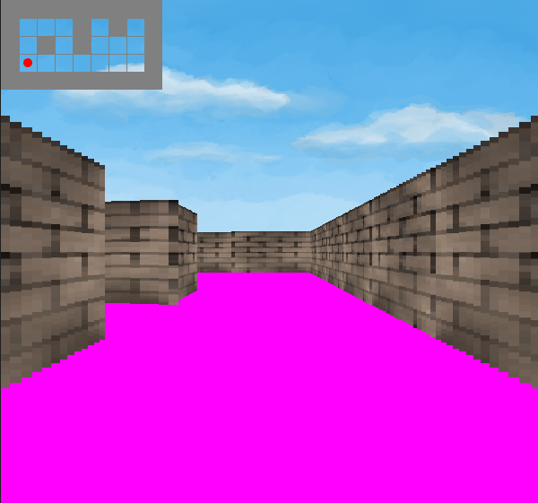

# Raycaster

This is a working Raycaster... but I don't recommend running it as I built this in High School and it is not the best.

Here is an image of the beautiful world:

It runs entirely off the Swing API and sometimes throws exceptions for using too much memory. But, it's not worth fixing. If you want
to try and improve upon it then I wish you the best!

To run simply load up in your favorite Java Idea and hit run on the Window Class (No one uses the Java command line tools anyways :) ).
